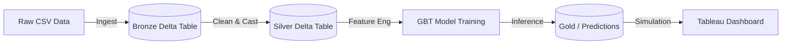

# 🏦 AI-Driven Credit Risk & Collection Optimization Engine

### **Reducing Unrecoverable Debt with Machine Learning & Lakehouse Architecture**

[](https://public.tableau.com/app/profile/anirudh.kumar2790/viz/CreditRiskOptimizationEngine-AICommandCenter/Dashboard1?publish=yes)
[](https://www.python.org/)
[](https://databricks.com/)

---

## 📊 Executive Summary
Banks and lenders lose millions annually in unrecovered debt due to inefficient collection strategies. Traditional "random calling" wastes resources on low-value or low-risk accounts.

This project implements an **AI-Driven Credit Risk Engine** that:
1.  **Ingests & Cleans** 2.2M+ loan records using a **Medallion Architecture** (Bronze/Silver/Gold).
2.  **Predicts Default Probability** using a Gradient Boosted Tree (GBT) classifier (AUC ~0.71).
3.  **Simulates Business Impact** to compare AI-based prioritization vs. random calling.
4.  **Visualizes ROI** in an interactive **Tableau Command Center**.

### **🚀 Key Business Impact**
* **2.5x Efficiency Lift:** The AI model recovers **$796 per call** vs. **$312** for the baseline strategy.
* **Profit Protection:** The simulation proves the AI strategy remains profitable even if call center costs triple.
* **Strategic "Gap":** Identified a $100M+ potential revenue gap between the AI strategy and random sampling at 20% capacity.

---

## 📸 Dashboard: The "Command Center"
*A snapshot of the financial simulation demonstrating the "Banana Curve" (cumulative recovery) and the efficiency gap.*


[🔴 **Click Here to Interact with the Live Dashboard**](https://public.tableau.com/app/profile/anirudh.kumar2790/viz/CreditRiskOptimizationEngine-AICommandCenter/Dashboard1?publish=yes)

---

## 🏗️ Technical Architecture

This project follows a modern **Lakehouse Architecture** on Databricks:

1.  **Bronze Layer (Raw):** Ingests raw CSV data into Delta Lake with schema enforcement.
2.  **Silver Layer (Cleansed):** Handles missing values (`Imputer`), casts data types, and removes PII/duplicates.
3.  **Gold Layer (Features):** Feature engineering (Vector Assembly) and Probability Scoring.
4.  **Modeling:** PySpark MLlib (GBTClassifier) with Cross-Validation for hyperparameter tuning.
5.  **Analytics:** Simulation logic to calculate cumulative recovery curves.


## 🛠️ Tech Stack
* **Cloud Platform:** Databricks (Paid Tier / Community Edition)
* **Language:** Python (PySpark)
* **Data Engineering:** Delta Lake, Medallion Architecture
* **Machine Learning:** Spark MLlib (GBTClassifier, VectorAssembler, Pipeline)
* **Visualization:** Tableau Public, Pandas (for downsampling)
* **Version Control:** Git & GitHub

---

## 📂 Repository Structure
```bash
├── 01_Ingest_Bronze.ipynb       # Raw data ingestion into Delta tables
├── 02_Clean_Silver.ipynb        # Data cleaning, casting (try_cast), and null handling
├── 03_Train_PD_Model.ipynb      # ML Pipeline: Feature engineering & GBT training
├── 04_Financial_Simulation.ipynb # "AI-Driven Collections Command Center" simulation
├── results/                     # Exported CSVs and Dashboard screenshots
└── README.md                    # Project documentation
```
---

## 📉 Simulation Logic
The core value of this project is the **Financial Simulation**. We evaluated the "Lift" by simulating a real-world collection scenario:

* **Ranking:** Every account is assigned a `risk_score` (probability of default).
* **The Baseline:** A "Random" strategy where customers are called in no particular order.
* **The AI Strategy:** A "Model-Driven" strategy where we call the riskiest customers first.
* **Metric:** Cumulative recovery is calculated at 1% increments of total call center capacity.

**Profit Calculation Formula:**
$$\text{Net Profit} = (\text{Total Recovered Amount} \times \text{Recovery Rate}) - (\text{Calls Made} \times \text{Cost Per Call})$$
